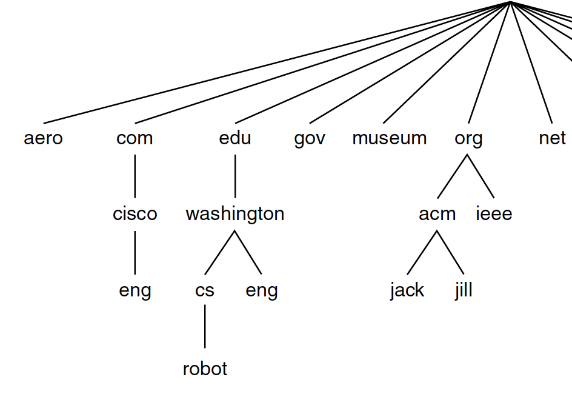

<!-- page_number: true -->

# VE489 Computer Networks
## Domain Name System
Author: Qinye Li  
Date: June 30, 2017

<!--{:TOC}-->

*Material with thanks Prof. Mosharaf Chowdhury*

---

# What is DNS?

Domain Name System is the system and protocol that maps domain names to IP addresses.

**Domain name**: ji.sjtu.edu.cn
**Ip address**: 202.121.178.212

---

# Why DNS?

* Convenience
	* ji.sjtu.edu.cn is easier to rememeber than 202.121.178.212
* Indirection
	* Decouple name from address
	* Load balancing

---

# History of DNS

Once upon a time.. 
* All mappings managed by Stanford Research Institute (SRI)
* Distributes `hosts.txt` to every computer
* Changes submitted to SRI
* Updates fetched from SRI

---

# History of DNS

Problems:
* Poor scalability
* Name conflict
* Inaccurate copies of `hosts.txt`

---

# Hierarchical namespace



---

# Hierarchical namespace


* Name is a leaf to root path: `robot.cs.washington.edu`
* Pro
	* Name collision avoided
	* Distributed administration
---

# Hierarchical administration


* Top-level domains managed by ICANN (Internet Corporation for Assignmed Names and Numbers)
e.g. com edu gov jp uk ...

* UW controls the domain `washington.edu`
* SJTU controls the domian `sjtu.edu.cn`

---

# Hierarchy of servers

* Root servers
* Top-level domain (TLD) servers
* Authoritative DNS servers
	* Actually store the name-to-address mapping
	* Maintained by the corresponding administrative authority

<span style="color:blue">
The idea is:

* All the servers know root servers
* Root servers know all about top-level domains
</span>

---

# Name Resolution

## Iterative Name Resolution
## Recursive Name Resolution

---

# DNS caching

* Caching
	* Authoritative records
	* Cached records (TTL)
* Negative caching
e.g. www.biadu.com

---

# Demo
## Experimental setting

* Wireshark: you guys know this!
* dig: command-line tool for querying remote DNS servers

---

# Demo

We somehow know that there is an root server @ 198.41.0.4

```bash
dig @198.41.0.4 ji.sjtu.edu.cn
```