<!-- page_number: true -->

# VE489 Mid Review -- Data Link Layer

Author: Qinye Li   
Date: June 27, 2017

{:TOC}

---

# Mid Schedule

**Time**: next class
**Location**: this classroom
**Cheatsheet**: A4, double-sided

* Qinye's office hour migrated to Wednesday @ ylm center
* Send me an email beforehand if you have a rather complicated question.

---

# Background

## Link Layer
* Logic Link Control (LLC) Layer
	* Error Control
		* FEC
		* ARQ
	* Flow Control (vs. Congestion Control)
* Medium Access Control (MAC) Layer
	* Framing, checksum
	* Link Control

---

# Highlights

* Framing
	* Bit oriented framing & bit-stuffing
* ARQ
	* Stop and Wait
	* Go Back N
	* Selective Repeat

---

# Framing

## Why framing?

Sender needs to set boundaries in between continuous bits so that these bits can be sent out **frame by frame**;  
Receiver relies on the boundaries to **detect start and end of a new frame**.

---

## How framing?

* **Character-oriented framing** (Flog bytes with byte stuffing)
* **Bit-oriented framing** (Flag bits with **bit stuffing**)

---

## Character-oriented framing
* **Binary Synchronous Communication**
	* Start flag: STX
    * End flag: ETX
    * Escape: DLE
    * DLE STX to indicate start; DLE ETX to indicate end
    * DLE in the original message stuffed with DLE
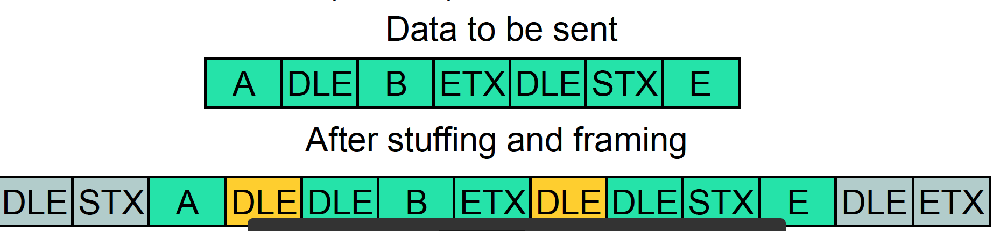

---

* **Point-to-Point Protocol** (**PPP**)
    * Flag: 0x7E (01111110)
    * Escape: 0x7D (01111101)
    * Indicate start and end with Flag
    * For Flag and Excape in the original data, add Escape and XOR with 0x20 (00100000)
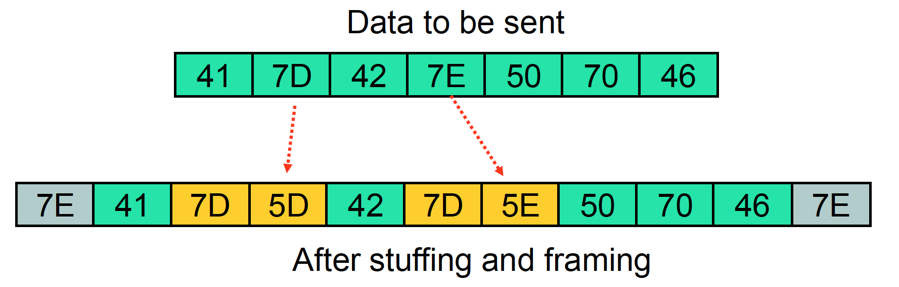

---

## Bit-oriented framing
### Stuffing
* Indicate start and end of frames with 0111110 (0x7E)
* Stuff a 0 after 11111 in the original data

e.g. Original message
01101111 11101011 10110100 00101111 11011011 10111111 11010111 11111110 

Stuffed message:
**01111110** 01101111 101101011 10110100 00101111 101011011 101111101 11010111 1101111100 **01111110**

---

### Destuffing

1. Find 5 consecutive 1s
2. If the following bit is 0, it is a stuffed bit. Destuff it.
3. If the following bits are 10, it is an flag.
4. If the following bits are 11, there must be an error.

e.g. Received message
**01111110** 011111 0 0011111 1 01010011 **01111110**

original message:
011111 0011111 101010011

---

# ARQ (Automatic Repeat Request)

## Why ARQ?

To ensure a sequence of information packets are delivered in-order, error-free and without loss or duplication despite tranmission errors and loess.

In a word: **To ensure in-order, error-free delivery**

---

## How ARQ?

* Stop and Wait
* Go-Back N
* Selective Repeat

---

## Stop-and Wait ARQ

* Transmit and wait for ACK
* Does not work well for high BDP

---

### Why timeout?
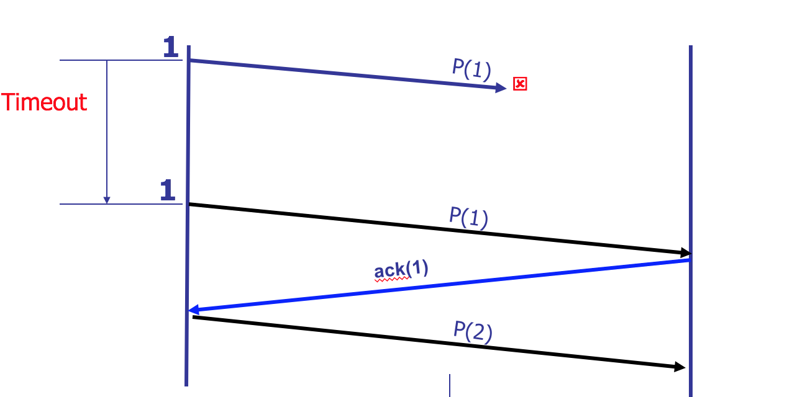

---

### Why sequence number?
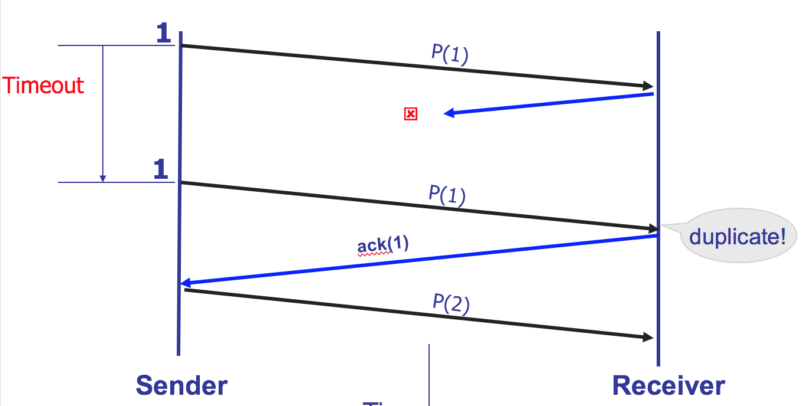

---

### Why sliding window?

* For congestion control and/or flow control

### Basic ideas of sliding window:

* Window = set of adjacent sequence numbers
* Sender can send packets in sending window
* Receiver can accept packets in receiving window
* Window of slides on successful reception/ACK

---

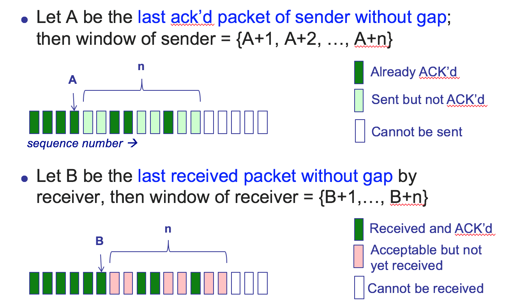

---

### Cumulative ACK vs. Selective ACK
* Cumulative ACK
	* carries next expected seqno
	* better when error rate is low
* Selecitve ACK
	* acknowledges received message's seqno individually
	* better when error rate is high

---

### Cumulative ACK vs. Selective ACK
* With a focus on the receiving window
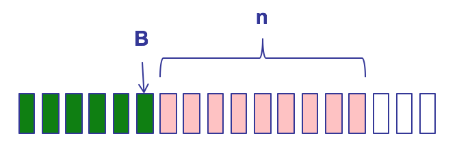
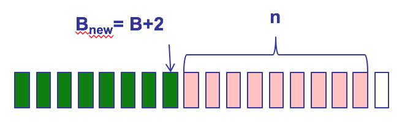
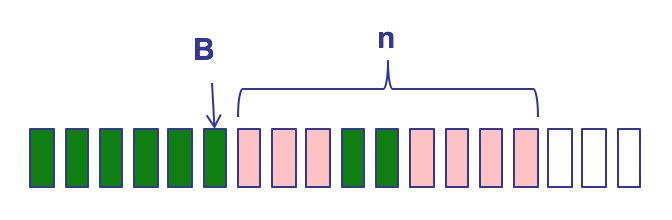

---

So for both cumulative ACK and selective ACK
* Sending window begins with the first unACKed data
* Receiving window begins with the first unreceived data

---

### Go-Back N vs. Selective Repeat

* Go-back N: receiver uses cumulative ACK
* Selective Repeat: receiver uses selective ACK

---

## Go-Back N ARQ

* Receiver uses cumulative ack and discards out-of sequence packets

* Retransmit **from** the next expected packet

---

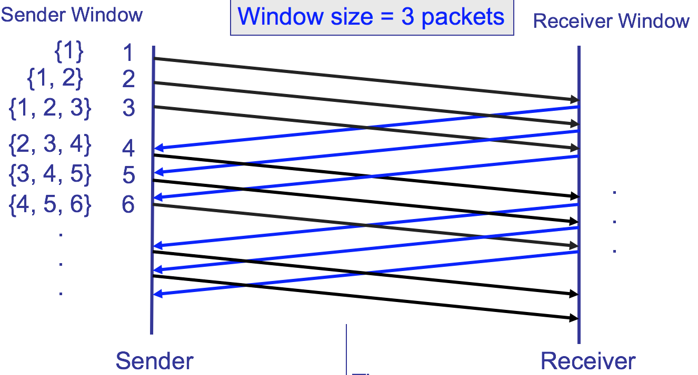

---

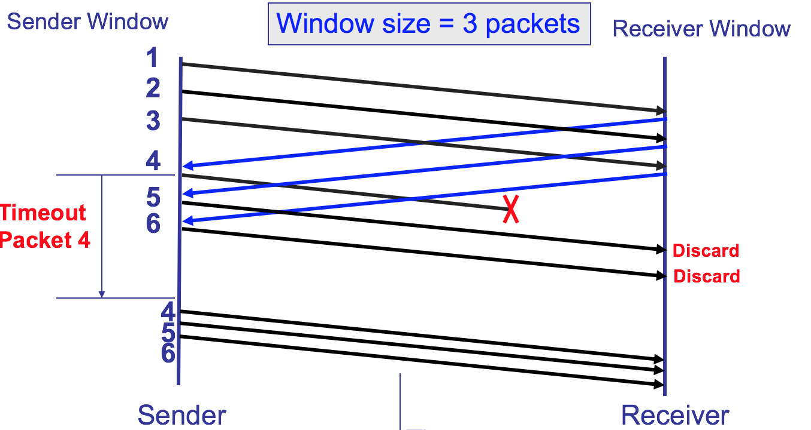

---

## Selective Repeat ARQ

* Receiver uses selective ack and buffers out-of-sequence packets

* Retransmit only unACK'd packets

---

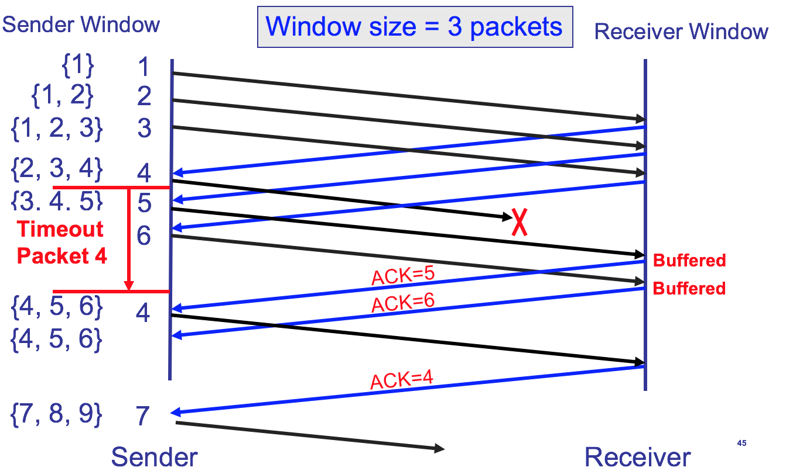

---

## Components of ARQ

* Timeout
* ACK & NACK
* Sequence Number
* Sending Window
* Receiving Window

**Their relationships**
* Assuming sequence number represented with m bits
* For GBN, Ws <= 2^m
* For SR, Ws + Wr <= 2^m