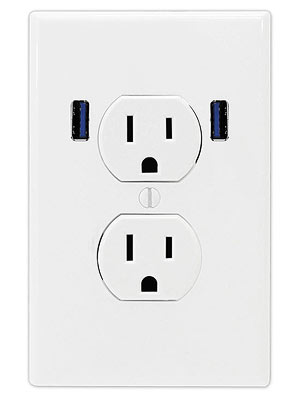

# VE489 Computer Networks
## Socket Programming
Author: Qinye Li  
Date: June, 2017

---

# What is a socket?



---

# Why socket?

* telnet
* wget
* curl

---

# Types of Sockets

* Stream socket
	* Uses TCP
* Datagram socket
	* Uses UDP

---

# How to use socket?

---

# `socket()` -- returns the file descriptor

```cpp
// Create a stream socket (SOCK_STREAM)
// over the internet (AF_INET)
int sock = socket(AF_INET, SOCK_STREAM, 0);
```

```cpp
// Create a datagram socket (SOCK_DRAM)
// over the internet (AF_INET)
int sock = socket(AF_INET, SOCK_DGRAM, 0);
```
---

# `sockaddr_in`

Socket describes
* protocol

Socket address describes
* ip adderess
* port number

---

# `sockaddr_in`

```cpp
sockaddr_in addr;
addr.sin_family = AF_INET;
addr.sin_port = htons(port); 
// port number must be in the range 1024 to 65535
	
if (isServer) {
    addr.sin_addr.s_addr = htonl(INADDR_ANY);
    // INADDR_ANY means any connection
} else if (isClient) {
    addr.sin_addr.s_addr = inet_addr(hostIP.c_str());
}
```

---

# The Network Order

* General computer byte order: little-endian
* Network byte order: big-endian


```cpp
htonl() // host ot network long
htons() // host to network short
ntohl() // network to host long
ntohs() // netowrk to host short
```
---

## `htons()`, `htonl()`, `ntohs()` and `ntohl()`

```cpp
uint32_t htonl(uint32_t hostlong);
uint16_t htons(uint16_t hostshort);
uint32_t ntohl(uint32_t netlong);
uint16_t ntohs(uint16_t netshort);
```

---

# `bind()`
```cpp
// Request the port from os
// If port = -1, os will randomly assign a port
::bind(sock, (sockaddr*)&addr, sizeof(addr));
```

---


# `connect()`

```cpp
connect(sock, (sockaddr*)&addr, sizeof(addr));
```

---
# `listen()` and `accept()`

```cpp
listen(sock, 0);
int clientSock = accept(sock, 0, 0);
```

---

# `send()` and `recv()`

```cpp
if (isClient) {
    connection = sock;
} elseif (isServer) {
    connection = clientSock;
}
```

---
```
string message;
send(connection, message.c_str(), message.size(), 0);
// returns the number of bytes actually sent
```

```
char buf[BUFFER_SIZE];
recv(connection, buf, BUFFER_SIZE, 0); // blocking
// returns the number of bytes actually received
// If returns 0, the remote side has closed the connection
```

---

# `close()`

```cpp
close(connection);
```

---

# Code it defensively!

```cpp
if (::bind(...)) {
	cerr << strerror(errno) << endl;
}
```

```cpp
if (listen(...)) {
	cerr << strerror(errno) << endl;
}
```

```cpp
if (connect(...)) {
	cerr << strerror(errno) << endl;
}
```
---

# Code it defensively!
```cpp
int bytesReceived = 0;
while(bytesReceived <= bytesExpected) {
	int rc = recv(connection, buf, BUFFER_SIZE, 0);
    if (rc == -1) {
    	cerr << strerror(errno) << endl;
    }
    bytesReceived += rc;
}
```

```cpp
recv(connection, buf, BUFFER_SIZE, MSG_WAITALL);
```

---

# Demo

---

# Talk to me the Datagram style ; - )
# `sendto()` and `recvfrom()`

```cpp
string message;
sendto(sock, message.c_str(), message.size(), 0,
        (sockaddr*) &addr, sizeof(sockaddr_in));
```

```cpp
char buf[BUFFER_SIZE];
recvfrom(sock, buf, BUFFER_SIZE, 0,
        (sockaddr*) &addr, sizeof(sockaddr_in));
```
---

# Ref

[1] [Wikipeadia -- Network socket](https://en.wikipedia.org/wiki/Network_socket)
Wikipeadia can be a nice starting point for you to explore a new concept!

[2] [Beej's Guide to Network Programming](http://beej.us/guide/bgnet/output/html/multipage/index.html)
Explains socket programming in a beginner-friendly way. Helped me a LOT when I was doing my 489 projects. Recommended by my EECS489 instructor.