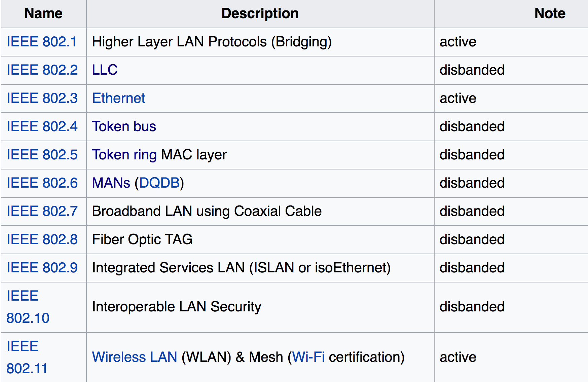
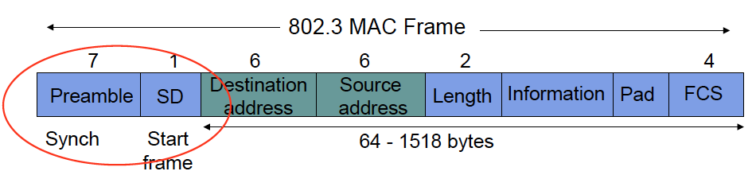
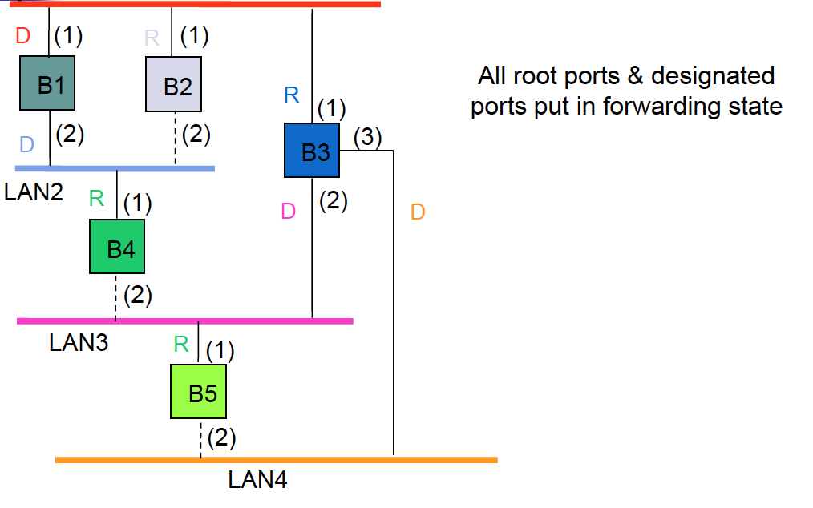

<!-- page_number: true -->

# VE489 Recitation 4 -- Medium Access Control
Author: Qinye Li  
Date: July 11, 2017

---

# Recap

* Data Link Layer
	* Logical Link Control
	* Medium Access Control
		* Channelization (e.g. TDMA, FDMA, CDMA)
		* Random Access (e.g. Aloha, Slotted Aloha, CSMA/CD)
		* **Scheduling**

---

# Scheduling

* Aim: allocate resource; schedule frame transmission to avoid collision
* Goal:
	* Channel utilization
	* Reduce var in delays
	* Fairness between stations
* Approaches
	* Reservation
	* Polling
	* *Diff?*

---

# Reservation

* **Centralized reservation**: a central controller accepts requests from station and issues grants to transmit
* **Distributed reservation**: a decentralized algorithm to determin transmission order

---

## Channelized vs. Random Access Reservation

*M* : # of minislots in a frame  
*N* : # of users

* **Channelized reservation**
	* If *M = N*
	* Reservation message typically follows TDMA
* **Random Access reservation**
	* If *M << N*
	* Reservation message are transmitted randomly

---

## Efficiency of Channelized Reservation

*X*: transmission time of a frame  
*M* : # of minislots in a frame  
*N* : # of users

* **Single Frame Reservation**

$$\rho_{max} = \frac{MX}{MvX + MX} = \frac{1}{1 + v}$$

* **Multiple Frame Reservation**

$$\rho_{max} = \frac{MkX}{MvX + MkX} = \frac{1}{1 + \frac{v}{k}}$$

---

## Efficiency of Random Access Reservation

$$\rho_{max} = \frac{X}{X (1 + ev)} = \frac{1}{1 + 2.71v}$$

e.g. GPRS
* Uses slotted Aloha for reservation
* Single / multiple frame reservation

---

# Polling

## Centralized Polling
## Distributed Polling

---

## Polling Service Limit
How much is a station allowed to transmit per poll?
* Exhaustive
* Gated
* Frmae-limited
* Time-limited

---

## Walk Time & Cycle Time

* Walk time: from a sation completes transmission to the next station begins transmission
* Cycle Time: between consecutive polls of one station

$$\mathrm{\frac{Overhead}{cycle} = \frac{\Sigma\ Walk\ Time}{Cycle\ Time}}$$

---

## Avg Cycle Time (assuming exhaustive service)

* $M$: # of stations
* $t'$: walk time
* $\lambda$: frame arrival rate **at the system**
* $X$: frame transmission time

Then, average cycle time is
$$T_C = \frac{Mt'}{1-\rho}, \ \mathrm{where}\ \rho = \lambda X$$

---

## Efficiency

* If exhaustive service

$$\mathrm{Efficiency} = \frac{T_C - Mt'}{T_C} = \rho$$

* If limited service, (assume single frame per poll)

$$\mathrm{Efficiency} = \frac{MX}{MX + Mt'} = \frac{1}{1 + t'/X}$$

---

## Token-Passing Rings -- a Distributed Polling Method

p58 -

---

# Comparision between MAC approaches

* Random Access
	* Aloha, Slotted Aloha
	* CSMA, CSMA/CD, CSMA/CA
* Scheduling
	* Reservation
	* Polling

---

# IEEE 802
* A family of IEEE standards dealing with local area networks and metropolitan area networks
* Map to Data Link Layer and Physical Layer
* Splits Data Link Layer LLC and MAC

[Ref: Wikipeadia](https://en.wikipedia.org/wiki/IEEE_802)

---

---

## IEEE 802.3: Ethernet
* CSMA/CD
* Slot time
* Binary exponenial back off
	* For nth retransmission: 0 < r < 2^k, where k = min(n, 10)
	* Gives up after 16 transmissions

---

## IEEE 802.3: Ethernet

* Preamble: 10101010 * 7 times
* SD: 10101011
* FCS (Frame Checking Sequence): for error checking

---

## 802.11 Wireless LAN

Definitions:
* Basic Service Set (BSS)
* Extended Service Set (ESS): a set of BSS with with the same network name
* Each BSS has an Access Point (AP)

---

## Types of Wireless Network
* **Infrastructure Network**
* **Ad-hoc Network**
* WiFi Direct Network e.g. AirDrop
* Mesh Network

---

## Hidden Node & Exposed Node

---

## Distributed Coordination Function

* Distributed Coordination Function (DCF)
	* Contention Period (CP)
* Polling-based Coordination Function
	* Contention-Free Period (CFP)
	* AP act as the controller

Beacon Interval

---

## CSMA/CA (Subset of DCF)

-- Carrier-Sence Multiple Access w/ Collision Avoidance

1. Virtual Carrier Sensing
	* RTS/CTS
	* NAV
2. Backoff & Deferral
3. ACK Protection

---

### Virtual Carrier Sensing

* RTS/CTS
* NAV (Network Allocation Vector)
	* Reduce collision and saves power

---

### Backoff & Deferral

---

### ACK Protection with DIFS & SIFS

* DIFS: Destributed Inter-Frame Space
	* A design parameter
* SIFS: Short Inter-Frame Space
	* A system parameter

We want

$$DIFS > SIFS$$

---

## Bridging and Switching

* Physical Layer: hub, repeater
* Data Link Layer: bridge, switch
* Network Layer: router
* Transport and Application Layer: gateway

---

## Spanning Tree Algorithm

* Why? To solve broadcast storm

1. Select root bridge
2. Select root port for every bridge except the root bridge
3. Select designated bridge for each LAN

---

